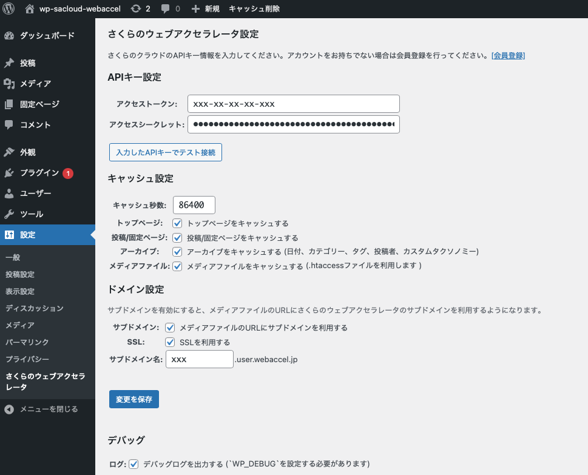

# WordPress plugin for SakuraCloud Web Accelerator

WordPressと[さくらのクラウド ウェブアクセラレータ](https://cloud.sakura.ad.jp/specification/web-accelerator/)との連携を行うためのプラグインです。

ウェブアクセラレータを利用すると、オリジンサーバーへの負荷を最小限にしつつ、
アクセス急増時でも安定してサイトを表示することができます。

このプラグインを利用することで、煩雑な設定を行うことなくウェブアクセラレータが利用できるようになります。

**注意:現在はβテスト中です。運用環境への適用の際は事前に十分な検証を行ってください。**

## 主な機能/特徴

以下のような機能を持っています。
詳細は[[このプラグインについて]](docs/About.md)を参照ください。

- `Cache-Control`レスポンスヘッダの出力
- APIでのキャッシュ自動削除
- メディアファイルのURL動的書き替え
- 小さなフットプリント
- WP-CLIのサポート

## スクリーンショット

## インストール

WordPressの管理ページからインストール可能です。

インストールの詳細は[[インストール / Installation]](docs/Installation.md)などを参照してください。

## 設定/その他ドキュメントなど

ドキュメントはこちらから参照ください。

[[wp-sacloud-webaccelドキュメント]](docs/README.md)

# License

GPLv3

# Copyright

Copyright 2016-2019 Kazumichi Yamamoto
