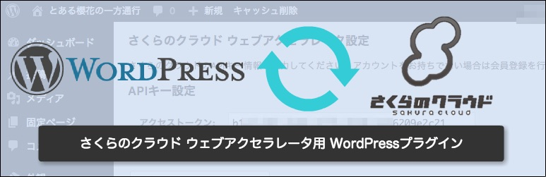
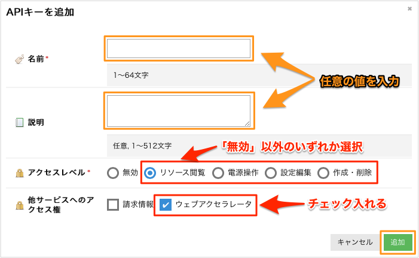
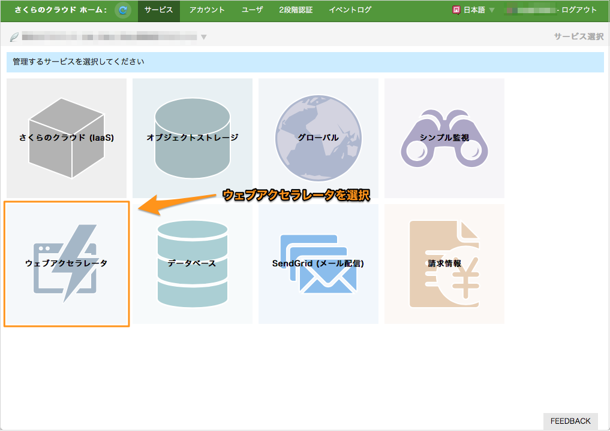
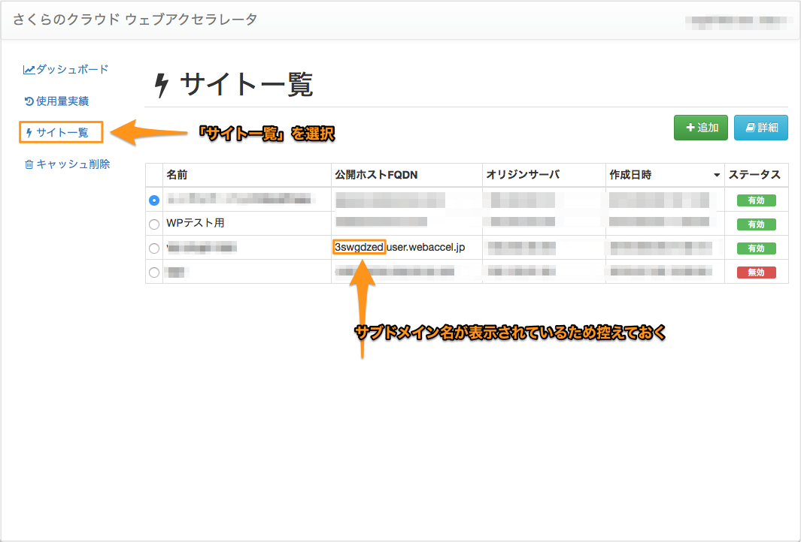
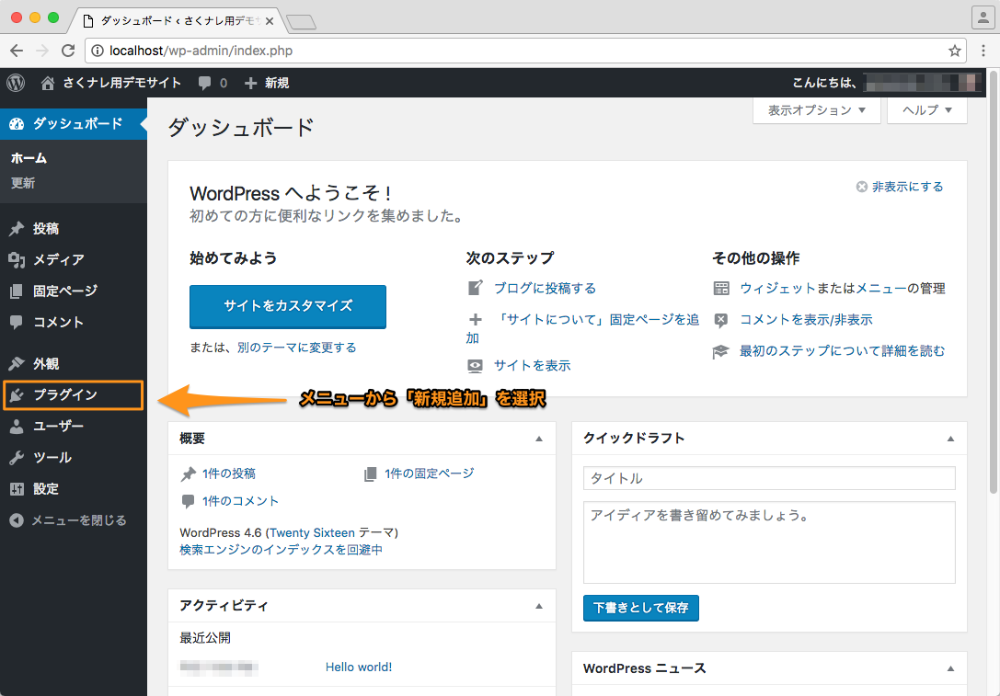
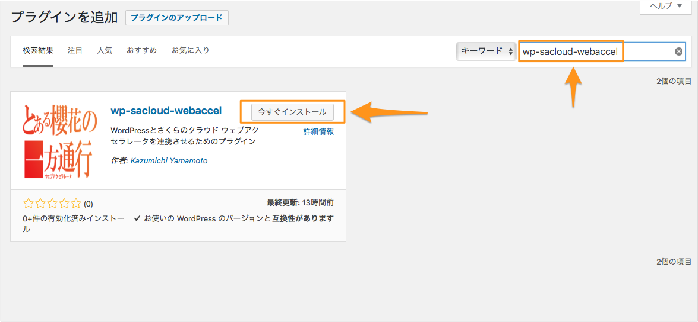
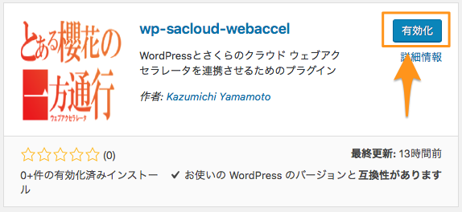

# wp-sacloud-webaccel

## インストール



## 目次

	- [システム要件](#システム要件)
	- [事前準備](#事前準備)
		- [APIキー発行](#apiキー発行)
		- [ウェブアクセラレータ設定](#ウェブアクセラレータ設定)
	- [プラグインのインストール](#プラグインのインストール)
	- [付録:手動でのインストール](#付録手動でのインストール)


## システム要件

	- WordPress : 4.5.3以降

WordPressのメディアライブラリ内のファイル(画像など)もキャッシュしたい場合は以下が必要です。

	- Apache(httpd) + mod_headers

もしNginxで動作させたい場合は[[付録:Nginxでの動作設定の例]](Settings.md#付録nginxでの動作設定の例)を参照してください。


## 事前準備

### APIキー発行

[さくらのクラウドのコントロールパネル](https://secure.sakura.ad.jp/cloud/)からAPIキーを発行します。

コントロールパネルにログインし、「さくらのクラウド(IaaS)」を選択します。


次に以下手順でAPIキーの追加画面を表示します。

	- (1) 画面右上の「設定」をクリックし、
	- (2) 左側に表示されるメニューから「APIキー」を選択し、
	- (3) 一覧の右上の「追加」をクリックします。


APIキーの追加画面が表示されたら、各項目を入力して「追加」をクリックします。

各項目は以下のように入力してください。

	- 名前 : 任意の名前を入力
	- 説明 : 任意入力
	- アクセスレベル : 「無効」以外の項目を選択
	- 他サービスへのアクセス権 : ウェブアクセラレータにチェックを入れる



APIキーを作成したら、以下の値を控えておいてください。

これらの値は、後ほどWordPress管理画面にて入力が必要となります。

	- アクセストークン
	- アクセスシークレット


以上でAPIキー発行完了です。

---

### ウェブアクセラレータ設定

続いてウェブアクセラレータの利用設定を行います。

以下のマニュアルを参考に設定を行ってください。

	- 独自ドメイン型の場合：[初期設定(独自ドメイン利用)](https://manual.sakura.ad.jp/cloud/webaccel/manual/settings-domain.html)
	- 独自ドメインのサブドメイン型の場合：[初期設定(独自ドメインにサブドメインを新規設定して利用)](https://manual.sakura.ad.jp/cloud/webaccel/manual/settings-domain-add-subdomain.html)
	- *.webaccel.jp のサブドメイン型の場合：[初期設定(サブドメイン利用)](https://manual.sakura.ad.jp/cloud/webaccel/manual/settings-subdomain.html)

#### サブドメイン名の確認(サブドメイン型の場合のみ必要)

サブドメイン型でウェブアクセラレータを利用する場合、サブドメイン名をWordPress管理画面にて入力する必要があります。
サブドメイン名は以下の手順で確認します。

さくらのクラウドコントロールパネルから、「ウェブアクセラレータ」を選択します。



次に左のメニューから「サイト一覧」を選択します。

右側に登録済みサイト一覧が表示されます。
「公開ホストFQDN」欄からサブドメイン名を控えておいてください。




---


## プラグインのインストール

WordPress管理画面からプラグインのインストールを行います。

WordPressへログイン後、左メニューから「プラグイン」、「新規追加」を選択します。



---

「プラグインを追加」画面が表示されます。
右上のキーワード欄に「wp-sacloud-webaccel」と入力してください。
プラグインが検索されたら「今すぐインストール」ボタンを押下します。



---

しばらく待つとインストールが完了するはずです。完了したら「有効化」ボタンを押下します。



以上でインストール完了です。

続けてプラグインの設定を行ってください。

---

Next : [[設定 / Settings]](Settings.md)

---


## 付録:手動でのインストール

手動でインストールする場合、以下の2つの方法があります。

	- プラグインのzipファイルをダウンロードして管理画面からアップロード
	- GitHubからソースコードを直接取得して配置する

zipファイルは以下からダウンロード可能です。

[GitHub:wp-sacloud-webaccelリリースページ](https://github.com/sacloud/wp-sacloud-webaccel/releases/latest)

GitHubからソースコードを直接取得する場合は次のようにしてください。

1. 以下のコマンドを実行してください。
2. 管理画面の「プラグイン」メニューから有効化してください。

```bash

# Move into WordPress root
cd [WORDPRESS_ROOT]/wp-content/plugins

# Clone plugin repository
git clone https://github.com/sacloud/wp-sacloud-webaccel
cd wp-sacloud-webaccel

```

---

Next : [[設定 / Settings]](Settings.md)

---
