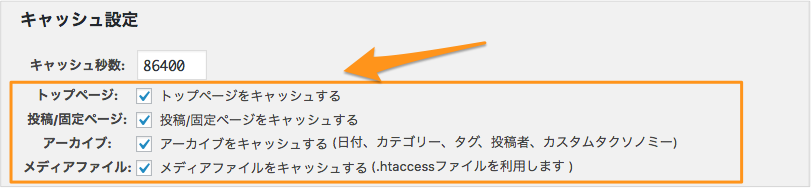
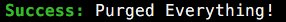

# wp-sacloud-webaccel

## その他


## 目次

  - [キャッシュ対象の設定について](#キャッシュ対象の設定について)
  - [更新時のキャッシュ削除ルール](#更新時のキャッシュ削除ルール)
  - [キャッシュの手動削除](#キャッシュの手動削除)
    - [WordPress管理画面からの削除](#wordpress管理画面からの削除)
    - [WP-CLIでの削除](#wp-cliでの削除)
    
## キャッシュ対象の設定について

キャッシュ動作は以下の設定項目によって制御されます。



### 記事ごとのキャッシュ無効化

投稿/固定ページにて`sacloud_nocache`という名前のカスタムフィールドに`1`を設定すると該当記事のキャッシュは行われなくなります。  
> 注: この設定は記事にのみ有効で、記事内のメディアファイルについては対象外です。

### 例外

以下の場合はキャッシュ対象外となります。

  - ログイン中ユーザーのリクエスト
  - ページング対象ページの2ページ目以降
  - 検索結果
  - コメント投稿者のリクエスト(`comment_author_email`cookieの有無で判定しています)
  - カスタムフィールド`sacloud_nocache`に`1`が設定されている投稿/固定ページ

---

## 更新時のキャッシュ削除ルール

記事の投稿など、データの更新時に以下のルールでキャッシュの削除が行われます。

### 記事(固定ページ)

##### 条件

  - 記事の作成/更新/削除時に、前後いずれかの記事の状態が「公開」、「予約投稿」である場合
  - コメント投稿(ピンバック受信、トラックバック受信含む)時に、前後いずれかのコメントの状態が「承認済み」である場合

##### 削除対象

  - 記事(固定ページ)のパーマリンク
  - コメントページ(`/comments`)
  - アーカイブ(日付)
  - トップページ
  - アーカイブ(カテゴリ/タグ/カスタムタクソノミー) ※1

※1:対象の記事にカテゴリ/タグ/カスタムタクソノミーが設定されていた場合、それぞれのページが削除対象に加わります。

また、それぞれのフィードも含まれます。

### メディアライブラリ

##### 条件

  - ファイルの登録/更新/削除が行われた場合

##### 削除対象

  - メディアファイル + リサイズされた全サイズのファイル(画像の場合のみ)
  - 個別添付ファイルページ

---

### カテゴリ/タグ/カスタムタクソノミー

##### 条件

  - カテゴリ/タグ/カスタムタクソノミーの更新/削除が行われた場合

##### 削除対象

  - カテゴリ/タグ/カスタムタクソノミーそれぞれのアーカイブページ
  - 対象を利用している記事のうち、公開状態のもの
  
記事のキャッシュ削除時の対象は[[記事(固定ページ)]](#記事(固定ページ))と同様です。


---

なお、テーマの変更などの、キャッシュの自動削除が行われない操作もあります。
この場合、[[キャッシュの手動削除]](#キャッシュの手動削除)に従い、手動でのキャッシュ削除を行ってください。


## キャッシュの手動削除

以下の方法でキャッシュを手動で削除することが出来ます。

### WordPress管理画面からの削除

[[設定 / Settings]](Settings.md)に従ってAPIキーの設定が正しく行われていると、
WordPress上部のメニューバーに「キャッシュ削除」ボタンが表示されます。


このボタンからキャッシュの全件削除が行えます。

### WP-CLIでの削除

[WP-CLI](http://wp-cli.org)がインストールされている場合、以下のコマンドでキャッシュの全件削除が行えます。

```bash
$ wp sacloud-webaccel purge-all
```

実行後、キャッシュ削除に成功すると以下のような表示になります。

#### 実行例



