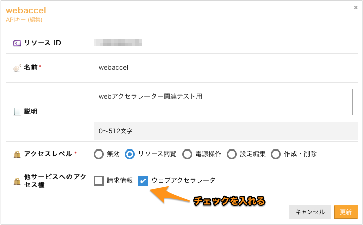

## インストール/設定

## 事前準備

  - [さくらのクラウドのコントロールパネル](https://secure.sakura.ad.jp/cloud/)からAPIキーを発行してください。

  - APIキーに対し「他サービスへのアクセス権」から `ウェブアクセラレータ`へのアクセス権を与えてください。

  - 作成したAPIキーの以下の値を控えておいてください。

    - アクセストークン
    - アクセスシークレット

---

## インストール

WordPress管理画面からプラグインのインストールを行います。

WordPressへログイン後、左メニューから「プラグイン」、「新規追加」を選択します。

---

「プラグインを追加」画面が表示されます。
右上のキーワード欄に「wp-sacloud-webaccel」と入力してください。
プラグインが検索されたら「今すぐインストール」ボタンを押下します。

[TODO ここにスクリーンショット追記]

---

しばらく待つとインストールが完了するはずです。完了したら「有効化」ボタンを押下します。

[TODO ここにスクリーンショット追記]

以上でインストール完了です。

## 設定

プラグインの動作に必要な、アクセスキーなどの設定を行います。

左のメニューから「設定」、「ウェブアクセラレータ」を選択します。

「さくらのクラウド　ウェブアクセラレータ設定」画面が表示されます。必要情報を入力していきます。

### APIキー設定

  - アクセストークン：先ほど控えた値を入力する
  - アクセスシークレット：先ほど控えた値を入力する

アクセストークンとシークレットを入力後、「入力したAPIキーでテスト接続」ボタンで接続確認が行えます。

各項目を入力したら「入力したAPIトークンでテスト接続」ボタンで接続確認が行えます。
入力値が正しい場合、以下のようなメッセージが表示されます。

エラーがある場合は以下のようなメッセージとなります。
この場合、各入力項目を再度確認してみてください。

ウェブアクセラレータへのアクセス権が設定されていない場合は以下のようなメッセージになります。
この場合、さくらのクラウドコントロールパネルから権限を与えてください。

### キャッシュ設定

ウェブアクセラレータでのキャッシュについての設定を行います。

### ドメイン設定

サブドメイン型でウェブアクセラレータを利用する場合に設定します。
(独自ドメイン型の場合は設定不要です)

以上で設定終了です。
