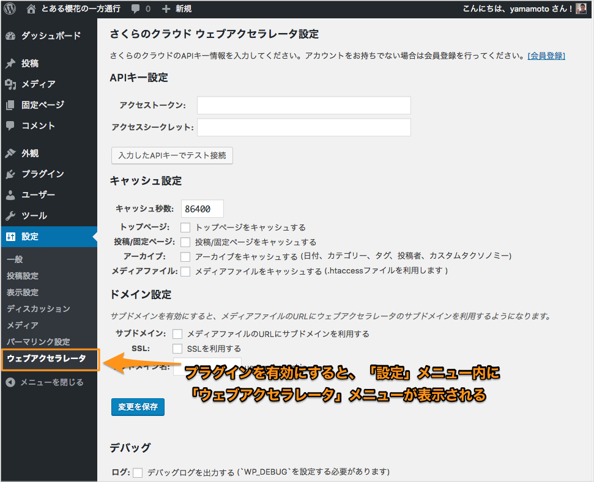
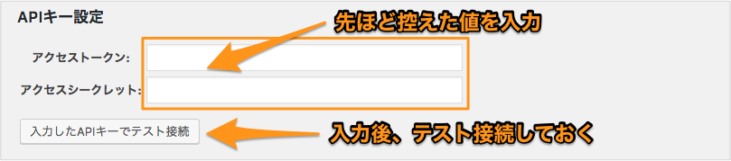
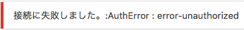
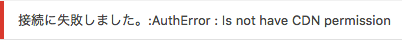
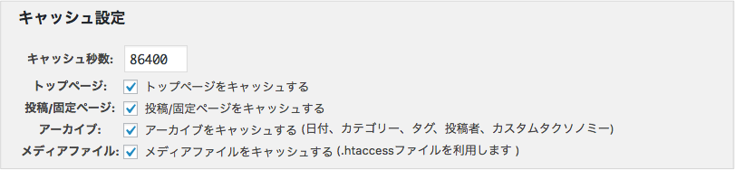
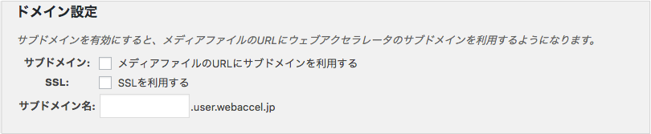

# wp-sacloud-webaccel

## 設定


## 目次

  - [プラグイン設定](#プラグイン設定)
    - [APIキー](#apiキー)
    - [キャッシュ](#キャッシュ)
    - [ドメイン](#ドメイン)
  - [付録:Nginxでの動作設定の例](#付録nginxでの動作設定の例)


## プラグイン設定

プラグインの動作に必要な、アクセスキーなどの設定を行います。

左のメニューから「設定」、「ウェブアクセラレータ」を選択します。



「さくらのクラウド　ウェブアクセラレータ設定」画面が表示されます。必要情報を入力していきます。

### APIキー



  - アクセストークン：先ほど控えた値を入力する
  - アクセスシークレット：先ほど控えた値を入力する

アクセストークンとシークレットを入力後、「入力したAPIキーでテスト接続」ボタンで接続確認が行えます。

各項目を入力したら「入力したAPIトークンでテスト接続」ボタンで接続確認が行えます。
入力値が正しい場合、以下のようなメッセージが表示されます。


エラーがある場合は以下のようなメッセージとなります。
この場合、各入力項目を再度確認してみてください。



ウェブアクセラレータへのアクセス権が設定されていない場合は以下のようなメッセージになります。
この場合、さくらのクラウドコントロールパネルから権限を与えてください。



### キャッシュ



ウェブアクセラレータでのキャッシュについての設定を行います。

### ドメイン



サブドメイン型でウェブアクセラレータを利用する場合に設定します。
(独自ドメイン型の場合は設定不要です)


以上で設定終了です。

---

Next : [[その他 / Other]](Other.md)
キャッシュ削除方法やWP-CLIでの操作、キャッシュ削除ルールなど。

---


## 付録:Nginxでの動作設定の例

メディアライブラリ内のファイル(画像など)での`Cache-Control`ヘッダ出力の制御は`.htaccess`にてmod_headersを利用して行っています。

このため、当プラグインが動作するにはApache(httpd) + mod_headersが必要ですが、同等の処理を行う設定ファイルを手動で作成することで
Nginxでも動作させることが可能です。

まず、Apache(httpd) + mod_headersの場合、当プラグインにて以下のような`.htaccess`ファイルが作成されます。

このファイルは、WordPressのアップロードディレクトリ(`wp_upload_dir()`)配下に作成されます。
(通常は`[WordPressインストール先]/wp-content/uploads/.htaccess`です)

```
# BEGIN wp-sacloud-webaccel
<IfModule mod_headers.c>
Header set Cache-Control "s-maxage=86400, public"
</IfModule>
# END wp-sacloud-webaccel
```

これと同等の処理をNginxで行う場合、設定ファイルに以下のように記述します。

**注意:以下の記述はサンプルです。実際に設定する際は、各サーバーに合わせて修正した上でご利用ください。**

```
location ~* ^/wp-content/uploads {
    add_header Cache-Control "s-maxage=86400, public";
}
```

---

Next : [[その他 / Other]](Other.md)
キャッシュ削除方法やWP-CLIでの操作、キャッシュ削除ルールなど。

---